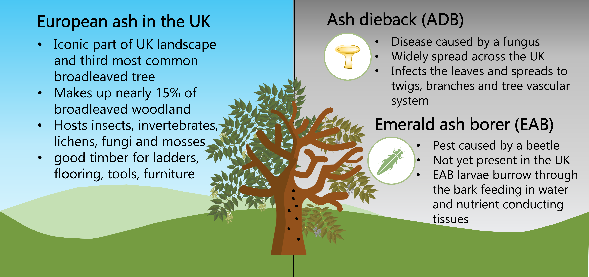
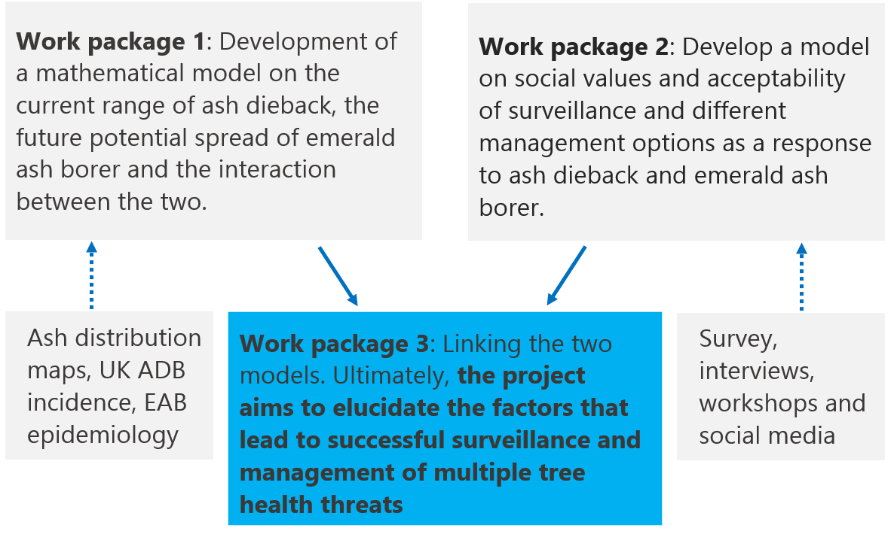

## The problem

We are focussing on two threats which impact on ash trees, one of the most common and valued tree species in the UK. Ash dieback has caused damage and loss to a high proportion of ash trees since its arrival in the UK in 2012. The second focus pest, emerald ash borer, is not currently known to be present in the UK but is spreading westwards from Moscow and into Ukraine as it “hitchhikes” on vehicles, in traded firewood and on live plants. In the United States, where emerald ash borer is an introduced species, it has caused the loss of hundreds of millions of trees. It is believed that if it arrives in the UK, it will pose a significant threat to our remaining ash trees due to their weakened state from ash dieback.

{: .full}
## The project

The project, Surveillance and Management of multiple Risks to Treescapes: Integrating Epidemiology and Stakeholder behaviour, will investigate how individuals and stakeholder groups can influence the successful detection and management of multiple risks to tree health focusing on ash trees.

With forests, hedgerows and other amenity trees (collectively treescapes), it is not always possible to prevent pests and diseases arriving, therefore, early detection and successful management are key areas where science can deliver.

Management guidance is often pest or disease specific, but management decisions are often made regarding host tree species that may face multiple threats. We will focus on the role of land managers and stakeholder groups in detecting threats and managing tree health.

Management plans for invasive species are often coordinated centrally, but in practice early detection can be improved by local engagement with landowners, land managers, or site visitors, thus, should planning account for their needs and encourage collaboration?

We will bring together forest-epidemiology, entomology, modelling and social science to determine what makes a successful surveillance and management programme.

The research is composed of three work packages:

